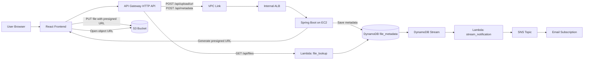
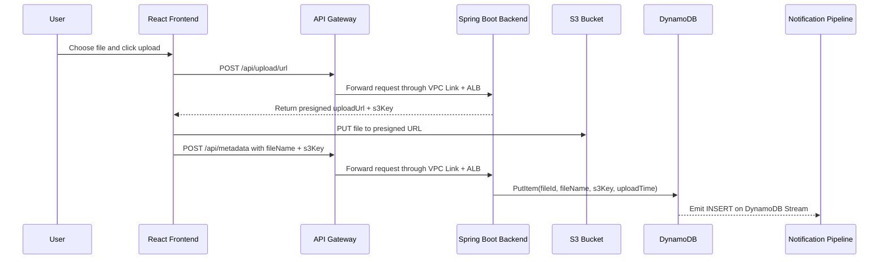
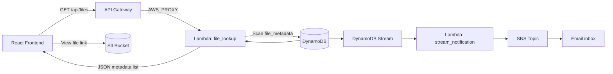

# File Upload Lookup Project

This project lets users upload files to S3 and look up previously uploaded files through a small React frontend, a Spring Boot backend, and AWS serverless components.

## Structure

| Path | Description |
| --- | --- |
| `frontend/` | React application for upload and lookup screens |
| `backend/` | Spring Boot API for presigned uploads and metadata writes |
| `lambdas/` | Lambda functions for file lookup and stream notifications |
| `terraform/` | Infrastructure as Code for API Gateway, S3, DynamoDB, Lambda, SNS, and networking |
| `docs/` | Architecture notes and diagrams |
| `scripts/` | Deployment helper scripts |

## Architecture overview

The system has two main request paths:

- Upload requests go through API Gateway to the Spring Boot backend running behind an internal ALB.
- File lookup requests go from API Gateway directly to a Lambda that reads DynamoDB.
- After metadata is written, DynamoDB Streams triggers another Lambda that publishes an SNS notification.



## Upload flow

The upload path is split into two stages: the backend creates a presigned URL, then the browser uploads the file directly to S3 and records metadata separately.



## Lookup and notification flow

Lookup is intentionally separated from the Spring Boot backend. API Gateway routes `GET /api/files` straight to Lambda, which reads DynamoDB and returns the saved file metadata. The frontend then builds direct S3 object links from the returned `s3Key` values.



## Build outputs (ignored by git)

- Frontend: `node_modules/`, `build/`, `dist/`
- Backend: `target/`, `build/`, `out/`
- Terraform: `.terraform/`, `*.tfstate`, `*.tfplan`

See `.gitignore` for the full list.

## Terraform setup

Set the SNS email subscription outside the tracked Terraform files before running `terraform plan` or `terraform apply`.

```hcl
# terraform/terraform.tfvars
sns_subscription_email = "you@example.com"
```

You can copy [`terraform/terraform.tfvars.example`](terraform/terraform.tfvars.example) to a local `terraform/terraform.tfvars` file, or provide the value through `TF_VAR_sns_subscription_email`.
