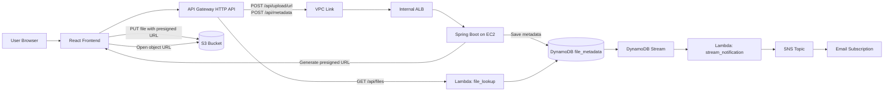
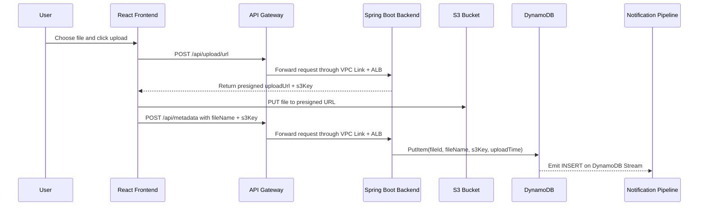
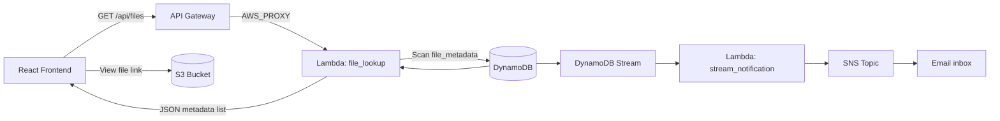

# File Upload Lookup Project

This project lets users upload files to S3 and look up previously uploaded files through a small React frontend, a Spring Boot backend, and AWS serverless components.

## Table of contents

- [Structure](#structure)
- [Quick start](#quick-start)
- [Architecture overview](#architecture-overview)
- [Why the architecture is split](#why-the-architecture-is-split)
- [Upload flow](#upload-flow)
- [Lookup and notification flow](#lookup-and-notification-flow)
- [API endpoints](#api-endpoints)
- [Configuration notes](#configuration-notes)
- [Deployment notes](#deployment-notes)
- [Known limitations](#known-limitations)
- [Build outputs (ignored by git)](#build-outputs-ignored-by-git)

## Structure

| Path | Description |
| --- | --- |
| `frontend/` | React application for upload and lookup screens |
| `backend/` | Spring Boot API for presigned uploads and metadata writes |
| `lambdas/` | Lambda functions for file lookup and stream notifications |
| `terraform/` | Infrastructure as Code for API Gateway, S3, DynamoDB, Lambda, SNS, and networking |
| `docs/` | Architecture notes and diagrams |
| `scripts/` | Deployment helper scripts |

## Quick start

### Prerequisites

- Node.js 18+ and `npm`
- Java 17 and Maven
- Terraform 1.5+
- AWS credentials with access to S3, DynamoDB, Lambda, API Gateway, SNS, IAM, ALB, and EC2 in `us-west-2`

### Run the frontend

```bash
cd frontend
npm install
npm run dev
```

The Vite app starts on `http://localhost:5173`.

### Run the backend

```bash
cd backend
mvn spring-boot:run
```

The Spring Boot API listens on `http://localhost:8080`.

### Local workflow notes

- The frontend currently points to a deployed API Gateway URL by default, not `localhost`.
- To test the frontend against a local backend, update `API_BASE_URL` in `frontend/src/services/fileUploadService.js`.
- Even when the backend runs locally, it still expects valid AWS credentials because it generates S3 presigned URLs and writes metadata to DynamoDB.

## Architecture overview

The system has two main request paths:

- Upload requests go through API Gateway to the Spring Boot backend running behind an internal ALB.
- File lookup requests go from API Gateway directly to a Lambda that reads DynamoDB.
- After metadata is written, DynamoDB Streams triggers another Lambda that publishes an SNS notification.



## Why the architecture is split

- The upload API stays in Spring Boot because presigned URL generation and metadata writes require trusted AWS access and a little more application logic.
- The lookup API is handled by Lambda because it is a simple read-only path that can sit directly behind API Gateway.
- Notifications are asynchronous so uploads do not block on email delivery.

## Upload flow

The upload path is split into two stages: the backend creates a presigned URL, then the browser uploads the file directly to S3 and records metadata separately.



## Lookup and notification flow

Lookup is intentionally separated from the Spring Boot backend. API Gateway routes `GET /api/files` straight to Lambda, which reads DynamoDB and returns the saved file metadata. The frontend then builds direct S3 object links from the returned `s3Key` values.



## API endpoints

| Method | Path | Implemented by | Purpose |
| --- | --- | --- | --- |
| `POST` | `/api/upload/url` | Spring Boot `UploadController` | Generate a presigned S3 upload URL and the `s3Key` to store |
| `POST` | `/api/metadata` | Spring Boot `MetadataController` | Persist file metadata in DynamoDB after the browser uploads to S3 |
| `GET` | `/api/files` | Lambda `file_lookup` | Return the uploaded file metadata list from DynamoDB |
| `GET` | `/api/upload/health` | Spring Boot `UploadController` | Simple backend health check used by the ALB target group |

### Example request and response shapes

`POST /api/upload/url`

```json
{
  "fileName": "report.pdf"
}
```

```json
{
  "uploadUrl": "https://...",
  "s3Key": "uploads/uuid-report.pdf"
}
```

`POST /api/metadata`

```json
{
  "fileName": "report.pdf",
  "s3Key": "uploads/uuid-report.pdf"
}
```

`GET /api/files`

```json
[
  {
    "fileId": "uuid",
    "fileName": "report.pdf",
    "s3Key": "uploads/uuid-report.pdf",
    "uploadTime": "2026-04-05T12:34:56Z"
  }
]
```

## Configuration notes

The current project uses several values directly in source or Terraform instead of environment-driven configuration:

| Setting | Current value | Where it is defined |
| --- | --- | --- |
| AWS region | `us-west-2` | Terraform provider and backend AWS config |
| API base URL | `https://z07qmg52sb.execute-api.us-west-2.amazonaws.com` | `frontend/src/services/fileUploadService.js` |
| S3 bucket | `file-upload-lookup-bucket` | Terraform and backend `S3Service` |
| DynamoDB table | `file_metadata` | Terraform, backend repository, and Lambda handlers |
| SNS email subscription | `<your-email>` | `terraform/sns.tf` |
| Allowed S3 CORS origin | `http://localhost:5173` | `terraform/s3.tf` |

If you fork this project or deploy a second copy, these are the first values you will likely want to parameterize.

## Deployment notes

The infrastructure is mostly defined in Terraform, but application deployment is still partially manual in the current repo.

1. Package or refresh the Lambda zip files in `lambdas/file-lookup/function.zip` and `lambdas/stream-notification/function.zip` if the handlers change.
2. Provision infrastructure:

    ```bash
    cd terraform
    terraform init
    terraform plan
    terraform apply
    ```

3. Build the frontend:

    ```bash
    cd frontend
    npm install
    npm run build
    ```

4. Build the backend:

    ```bash
    cd backend
    mvn clean package
    ```

5. Deploy the backend artifact to the EC2 instance behind the ALB. The `scripts/` directory exists for deployment helpers, but the checked-in script files are placeholders right now.
6. Confirm the SNS email subscription from the recipient inbox after the first Terraform apply.
7. Read the deployed API endpoint with:

    ```bash
    cd terraform
    terraform output api_gateway_url
    ```

## Known limitations

- The frontend hardcodes both the API Gateway base URL and the public S3 bucket URL pattern, so switching environments is manual.
- The lookup Lambda uses a DynamoDB `scan`, which is fine for a demo but will not scale well for large datasets.
- S3 CORS currently allows only `http://localhost:5173`, so additional frontend origins need Terraform changes.
- Several environment-specific values are hardcoded, including bucket names, table names, and the SNS subscription email.
- Deployment automation is incomplete because the repo includes placeholder helper scripts rather than a full release pipeline.

## Build outputs (ignored by git)

- Frontend: `node_modules/`, `build/`, `dist/`
- Backend: `target/`, `build/`, `out/`
- Terraform: `.terraform/`, `*.tfstate`, `*.tfplan`

See `.gitignore` for the full list.

## Terraform setup

Set the SNS email subscription outside the tracked Terraform files before running `terraform plan` or `terraform apply`.

```hcl
# terraform/terraform.tfvars
sns_subscription_email = "you@example.com"
```

You can copy [`terraform/terraform.tfvars.example`](terraform/terraform.tfvars.example) to a local `terraform/terraform.tfvars` file, or provide the value through `TF_VAR_sns_subscription_email`.
